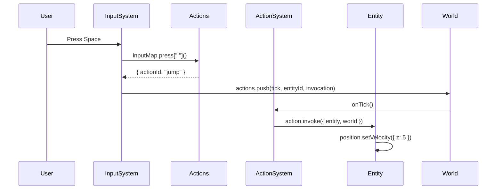

## Overview

Actions are invokable behaviors attached to entities. They represent discrete events like moving, shooting, or picking up items. Actions are queued in `world.actions` and executed by the ActionSystem.

## Core Types

### Action

```typescript
type Action<T extends {} = any> = {
  id: string
  cooldown: number | undefined
  cdLeft?: number
  prepare: (params: {
    params: T
    entity?: Entity
    player?: Player
  }) => InvokedAction
  invoke: (params: {
    params: T
    world: World
    entity?: Entity
    player?: Player
    character?: Character
    offline?: boolean
  }) => void
}
```

<ParamField path="id" type="string" required>
  Unique action identifier
</ParamField>

<ParamField path="cooldown" type="number">
  Ticks before action can be invoked again
</ParamField>

<ParamField path="prepare" type="function">
  Creates an InvokedAction for queueing
  ```typescript
  ({ params, entity?, player? }) => InvokedAction
  ```
</ParamField>

<ParamField path="invoke" type="function" required>
  Executes the action logic
  ```typescript
  ({ params, world, entity?, player?, character?, offline? }) => void
  ```
</ParamField>

### InvokedAction

```typescript
type InvokedAction<A extends string = string, P extends {} = {}> = {
  actionId: A
  characterId?: string
  playerId?: string
  entityId?: string
  params?: P
  offline?: boolean
}
```

Queued action ready for execution. Stored in `world.actions` tick buffer.

## Action Function

```typescript
Action<T>(id: string, invoke: Function, cooldown?: number): Action<T>
```

Creates an action with the specified behavior.

<ParamField path="id" type="string" required>
  Action identifier
</ParamField>

<ParamField path="invoke" type="function" required>
  Execution callback
  ```typescript
  ({ params, world, entity?, player?, character? }) => void
  ```
</ParamField>

<ParamField path="cooldown" type="number">
  Cooldown in ticks
</ParamField>

**Example**
```typescript core/src/ecs/entities/characters/Skelly.ts
jump: Action("jump", ({ entity }) => {
  if (!entity?.components?.position?.data.standing) return
  entity.components.position.setVelocity({ z: 5 })
})
```

## Built-in Actions

<AccordionGroup>
  <Accordion title="Movement" icon="arrows-up-down-left-right">
    ### Move
    ```typescript
    Move: Action<XY>
    ```
    Set entity velocity.

    **Parameters:**
    - `x: number` - Horizontal velocity
    - `y: number` - Vertical velocity

    **Example**
    ```typescript core/src/ecs/actions/movement/Move.ts
    Action<XY>("move", ({ params, entity }) => {
      if (!entity) return
      const { position } = entity.components

      if (params.x > 0) position.data.facing = 1
      if (params.x < 0) position.data.facing = -1

      position.setHeading({ x: NaN, y: NaN })
      position.setVelocity({
        ...((params.x !== undefined) ? { x: params.x } : {}),
        ...((params.y !== undefined) ? { y: params.y } : {})
      })
    })
    ```

    ### Point
    ```typescript
    Point: Action<{ pointing: Oct, pointingDelta: XY, aim: XY }>
    ```
    Update aiming direction.

    ### Chase
    ```typescript
    Chase: Action<{ targetId: string }>
    ```
    Move toward target entity.
  </Accordion>

  <Accordion title="Combat" icon="gun">
    ### Blaster
    ```typescript
    shoot: Action<{ pos: XYZ, aim: XY }>
    ```
    Fire projectile weapon.

    **Example**
    ```typescript core/src/ecs/actions/attacks/Blaster.ts
    shoot: Action<ShootParams>("shoot", ({ world, params }) => {
      const { pos, aim } = params

      // Play sound
      world.client?.sound.play({ name: "deagle" })

      // Apply recoil
      character.components.position.data.recoil = min(0.5, recoil + 0.45)

      // Raycast for hit
      const hit = blockInLine({ from: eyePos, dir, world, cap: 60 })

      if (hitboxHit) {
        hitboxHit.entity.components.health?.damage(2, world)
        hitboxHit.entity.components.three?.flash(0.5)
      }
    })
    ```

    ### Deagle
    ```typescript
    shoot: Action<ShootParams>
    ```
    Hitscan pistol.

    ### Dagger
    ```typescript
    stab: Action<StabParams>
    ```
    Melee attack.

    ### Hook
    ```typescript
    throw: Action<HookParams>
    ```
    Grappling hook.

    ### Whack
    ```typescript
    swing: Action<SwingParams>
    ```
    Basic melee swing.
  </Accordion>

  <Accordion title="Interactive" icon="hand-pointer">
    ### Eat
    ```typescript
    Eat: Action<{ foodId: string }>
    ```
    Consume food item for health.

    ### Place
    ```typescript
    Place: Action<{ blockType: number, position: XYZ }>
    ```
    Place voxel block.

    ### ItemActions
    ```typescript
    pickup: Action<{ itemId: string }>
    drop: Action<{ itemId: string }>
    use: Action<{ itemId: string }>
    ```
    Inventory item interactions.

    **Example**
    ```typescript
    dropItem: Action("dropItem", ({ entity, world }) => {
      const inventory = entity?.components.inventory
      if (!inventory) return

      const item = inventory.activeItem(world)
      if (!item) return

      inventory.dropActiveItem()
      item.components.item.dropped = true
    })
    ```
  </Accordion>

  <Accordion title="Player" icon="user">
    ### ControlEntity
    ```typescript
    ControlEntity: Action
    ```
    Link player to character.

    **Example**
    ```typescript core/src/ecs/actions/PlayerActions.ts
    Action("ControlEntity", ({ entity, player }) => {
      if (!entity || !player) return
      player.components.controlling = Controlling({ entityId: entity.id })
    })
    ```

    ### SwitchTeam
    ```typescript
    SwitchTeam: Action
    ```
    Toggle team membership.

    **Cooldown:** 10 ticks

    **Example**
    ```typescript core/src/ecs/actions/PlayerActions.ts
    Action("SwitchTeam", ({ entity, world }) => {
      if (!entity) return
      const { team, controlling } = entity.components
      if (!team) return

      team.switchTeam()

      const characterTeam = controlling?.getCharacter(world)?.components.team
      if (characterTeam) characterTeam.switchTeam()
    }, 10)
    ```

    ### Ready
    ```typescript
    Ready: Action
    ```
    Toggle ready state in lobby.

    **Cooldown:** 10 ticks
  </Accordion>
</AccordionGroup>

## Input to Action Flow



## Creating Custom Actions

### Basic Action

```typescript
import { Action } from "@piggo-gg/core"

export const Teleport = Action<{ x: number, y: number }>(
  "teleport",
  ({ params, entity }) => {
    if (!entity) return
    const { position } = entity.components

    position.setPosition({
      x: params.x,
      y: params.y
    })
  }
)
```

### Action with Cooldown

```typescript
export const Dash = Action<{ direction: XY }>(
  "dash",
  ({ params, entity }) => {
    if (!entity) return
    const { position } = entity.components

    position.impulse({
      x: params.direction.x * 10,
      y: params.direction.y * 10
    })
  },
  20 // 20 tick cooldown
)
```

### Action with Validation

```typescript
export const Heal = Action<{ amount: number }>(
  "heal",
  ({ params, entity, world }) => {
    if (!entity) return

    const { health } = entity.components
    if (!health) return

    // Don't heal if dead
    if (health.dead()) return

    // Don't overheal
    const newHp = Math.min(health.data.maxHp, health.data.hp + params.amount)
    health.data.hp = newHp

    world.client?.sound.play({ name: "heal" })
  }
)
```

### Networked Action

```typescript
export const SpawnProjectile = Action<{ position: XYZ, velocity: XYZ }>(
  "spawnProjectile",
  ({ params, world, player }) => {
    const projectile = Entity({
      id: `projectile-${world.tick}-${player?.id}`,
      components: {
        position: Position({
          x: params.position.x,
          y: params.position.y,
          z: params.position.z,
          velocity: params.velocity
        }),
        collider: Collider({ shape: "ball", radius: 0.5 }),
        networked: Networked(),
        expires: Expires({ ticksLeft: 100 })
      }
    })

    world.addEntity(projectile)
  }
)
```

## Invoking Actions

### From Input Handler

```typescript
input: Input({
  press: {
    "e": ({ entity }) => {
      return { actionId: "interact" }
    },
    "mb1": ({ aim, world }) => {
      return {
        actionId: "shoot",
        params: { aim, tick: world.tick }
      }
    }
  }
})
```

### From NPC Behavior

```typescript
npc: NPC({
  behavior: (entity, world) => {
    if (world.tick % 40 === 0) {
      return { actionId: "move", params: { x: 1, y: 0 } }
    }
  }
})
```

### Programmatically

```typescript
world.actions.push(
  world.tick + 1, // Execute next tick
  entity.id,
  {
    actionId: "heal",
    params: { amount: 20 },
    playerId: player?.id
  }
)
```

### From Another Action

```typescript
export const ComboAttack = Action("comboAttack", ({ entity, world }) => {
  // First hit
  world.actions.push(world.tick, entity.id, {
    actionId: "punch"
  })

  // Second hit
  world.actions.push(world.tick + 10, entity.id, {
    actionId: "kick"
  })
})
```

## ActionMap

```typescript
type ActionMap = Record<string, Action<any> | Action["invoke"]>
```

Shorthand for defining multiple actions.

**Example**
```typescript
actions: Actions({
  move: Move,
  jump: Action("jump", ({ entity }) => {
    entity.components.position.setVelocity({ z: 5 })
  }),
  // Shorthand syntax
  wave: ({ entity }) => {
    console.log("Player waved!")
  }
})
```

## See Also

- [Component API](/api/ecs/components) - Actions component
- [System API](/api/ecs/systems) - ActionSystem reference
- [Input API](/api/core/input) - Triggering actions from input
