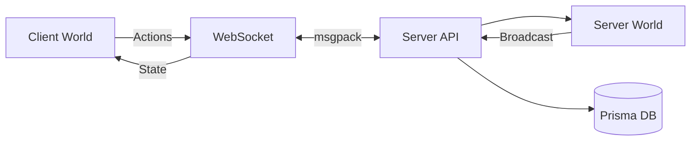

## High-Level Architecture

Piggo Games is built as a **multiplayer-first browser game framework** using an Entity-Component-System (ECS) architecture. The framework is designed to run the same game logic on both client and server, with deterministic simulation and network synchronization.

### Core Components

The architecture consists of four primary layers:

<CardGroup cols={2}>
  <Card title="World Runtime" icon="globe">
    Central game loop managing entities, systems, and game state
  </Card>
  <Card title="ECS Engine" icon="cube">
    Entity-Component-System architecture for game objects and logic
  </Card>
  <Card title="Rendering" icon="palette">
    Dual renderer support (Three.js for 3D, Pixi.js for 2D)
  </Card>
  <Card title="Networking" icon="network-wired">
    Client-server synchronization with rollback or delay netcode
  </Card>
</CardGroup>

## Monorepo Structure

Piggo is organized as a Bun workspace monorepo:

```
piggo/
├── core/          # Engine, ECS, game logic, shared code
├── web/           # Frontend client (React + Canvas)
├── server/        # WebSocket API, matchmaking, Prisma DB
├── docs/          # Documentation site
└── electron/      # Desktop wrapper
```

### Package Responsibilities

<AccordionGroup>
  <Accordion title="core/ - Game Engine">
    - **`src/runtime/`** - World loop, game lifecycle
    - **`src/ecs/`** - Components, systems, entities, actions
    - **`src/games/`** - Individual game implementations
    - **`src/net/`** - Client networking, syncers
    - **`src/graphics/`** - Three.js and Pixi.js renderers
    - **`src/html/`** - DOM overlay components
    - **`src/sound/`** - Audio system
  </Accordion>
  
  <Accordion title="server/ - Backend">
    - **`src/Api.ts`** - WebSocket and HTTP endpoints
    - **`src/ServerWorld.ts`** - Server-side world instance
    - **`src/db/`** - Prisma schema and migrations
    - Handles matchmaking, lobbies, authentication
  </Accordion>
  
  <Accordion title="web/ - Frontend">
    - React application mounting the game canvas
    - **`src/components/Canvas.tsx`** - Initializes World with renderers
    - Static assets in `res/` (SVG, audio)
  </Accordion>
</AccordionGroup>

## Game Loop Architecture

<Steps>
  <Step title="World Initialization">
    Create a `World` instance with commands, systems, and renderer:
    
    ```typescript
    // From: core/src/runtime/World.ts:65
    export const World = ({ commands, systems, pixi, mode, three }: WorldProps): World => {
      const world: World = {
        entities: {},
        systems: {},
        tick: 0,
        tickrate: 25,  // 25ms per tick = 40 ticks/second
        // ...
      }
      return world
    }
    ```
  </Step>
  
  <Step title="Fixed Timestep Tick Loop">
    Systems execute at a fixed 25ms interval:
    
    ```typescript
    // From: core/src/runtime/World.ts:173
    onTick: ({ isRollback, force }) => {
      // Update tick counter
      world.tick += 1
      world.time = performance.now()
      
      // Run systems by priority
      values(world.systems)
        .sort((a, b) => a.priority - b.priority)
        .forEach((system) => {
          system.onTick?.(filterEntities(system.query, values(world.entities)), isRollback)
        })
    }
    ```
  </Step>
  
  <Step title="Variable Framerate Render Loop">
    Rendering runs at display refresh rate (60+ FPS):
    
    ```typescript
    // From: core/src/runtime/World.ts:240
    onRender: () => {
      const delta = now - world.time
      const since = now - lastRender
      
      values(world.systems).forEach((system) => {
        system.onRender?.(filterEntities(system.query, values(world.entities)), delta, since)
      })
    }
    ```
  </Step>
</Steps>

<Note>
The separation of tick (game logic) and render (visual updates) allows for deterministic simulation while maintaining smooth visuals through interpolation.
</Note>

## Client-Server Architecture



### Dual-World Design

Both client and server run the **same World instance** with identical game logic:

<CodeGroup>
```typescript Client Mode
// From: web/src/components/Canvas.tsx
const world = World({
  mode: "client",
  pixi: PixiRenderer(),
  three: ThreeRenderer()
})
```

```typescript Server Mode
// From: server/src/ServerWorld.ts
const world = World({
  mode: "server"
  // No renderers on server
})
```
</CodeGroup>

### Network Flow

1. **Client** sends player actions via WebSocket (msgpack encoded)
2. **Server** validates, broadcasts to all clients in lobby
3. **Clients** apply actions and reconcile state using chosen netcode strategy

<Tip>
See [Netcode](/concepts/netcode) for details on rollback vs. delay synchronization.
</Tip>

## Game Definitions

Each game is defined as a `GameBuilder` that returns configuration:

```typescript
// From: core/src/games/volley/Volley.ts:33
export const Volley: GameBuilder<VolleyState, VolleySettings> = {
  id: "volley",
  init: (world) => ({
    id: "volley",
    netcode: "rollback",      // or "delay"
    renderer: "pixi",          // or "three"
    settings: {
      showControls: true
    },
    state: {
      phase: "point",
      scoreLeft: 0,
      scoreRight: 0,
      // ...
    },
    systems: [
      PhysicsSystem("global"),
      VolleySystem,
      PixiRenderSystem,
      // ...
    ],
    entities: [
      Ball(),
      Court(),
      Net()
    ]
  })
}
```

### Game Registry

All games are registered in the World:

```typescript
// From: core/src/runtime/World.ts:84
games: {
  "build": Build,
  "craft": Craft,
  "lobby": Lobby,
  "island": Island,
  "strike": Strike,
  "volley": Volley,
  "mars": Mars,
  "hoops": Hoops,
  "legends": Legends,
  "jam": Jam
}
```

## Key Architectural Principles

<CardGroup cols={2}>
  <Card title="Deterministic Simulation" icon="equals">
    Same inputs always produce same outputs, enabling rollback netcode
  </Card>
  <Card title="Data-Oriented Design" icon="database">
    Components store data, systems process entities with matching components
  </Card>
  <Card title="Shared Logic" icon="clone">
    Client and server run identical game code for consistency
  </Card>
  <Card title="Renderer Agnostic" icon="eye">
    Games can switch between 2D (Pixi) and 3D (Three.js) renderers
  </Card>
</CardGroup>

## Next Steps

<CardGroup cols={3}>
  <Card title="ECS" icon="cubes" href="/concepts/ecs">
    Learn about entities, components, and systems
  </Card>
  <Card title="World" icon="globe" href="/concepts/world">
    Understand the World runtime
  </Card>
  <Card title="Games" icon="gamepad" href="/concepts/games">
    Build your own game
  </Card>
</CardGroup>
