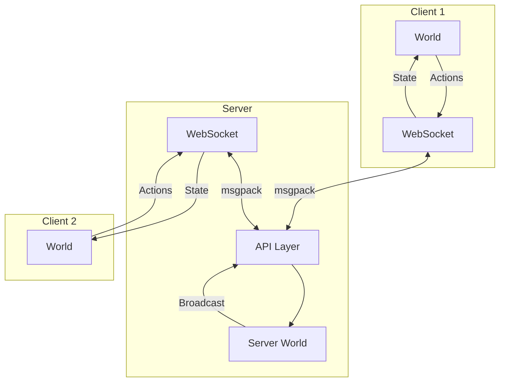

## Network Architecture

Piggo uses a **client-server architecture** with authoritative server:



### Key Concepts

<CardGroup cols={2}>
  <Card title="Deterministic Simulation" icon="equals">
    Same inputs → Same outputs
    
    Both client and server run identical game logic
  </Card>
  
  <Card title="Action Synchronization" icon="arrows-rotate">
    Send player actions, not state
    
    Server validates and broadcasts to all clients
  </Card>
  
  <Card title="State Reconciliation" icon="check-double">
    Client predicts, server corrects
    
    Rollback or delay strategies to handle latency
  </Card>
  
  <Card title="Serialization" icon="file-code">
    msgpack binary encoding
    
    Efficient network transfer
  </Card>
</CardGroup>

## Network Message Types

```typescript
// From: core/src/net/Netcode.ts:10
export type NetMessageTypes = GameData | LatencyData | RequestData | ResponseData

export type GameData = {
  type: "game"
  actions: Record<number, Record<string, InvokedAction[]>>  // tick → entityId → actions
  chats: Record<string, string[]>
  game: GameTitle
  playerId: string
  serializedEntities: Record<string, SerializedEntity>      // Full state snapshot
  tick: number
  timestamp: number
  latency?: number
  diff?: number  // Client-server tick difference
}
```

### Actions

Player inputs are sent as actions:

```typescript
export type InvokedAction = {
  actionId: string      // "move", "jump", "shoot"
  playerId?: string
  offline?: boolean     // From another client (rollback)
  // ... action-specific data
}
```

## Netcode Strategies

Piggo supports two synchronization strategies:

### Rollback Netcode

**Best for:** Fast-paced games (shooters, fighting games, sports)

<Steps>
  <Step title="Client Prediction">
    Client immediately applies local actions without waiting for server
    ```typescript
    // Player presses jump
    world.actions.push(world.tick, playerId, { actionId: "jump" })
    // Character jumps immediately on client
    ```
  </Step>
  
  <Step title="Send to Server">
    ```typescript
    // From: core/src/net/RollbackSyncer.ts:97
    write: (world) => ({
      actions: world.actions.fromTick(world.tick, s => s.offline !== true),
      tick: world.tick,
      serializedEntities: {},  // Only send actions, not full state
      // ...
    })
    ```
  </Step>
  
  <Step title="Server Validates & Broadcasts">
    Server runs same simulation, broadcasts authoritative state to all clients
  </Step>
  
  <Step title="Client Reconciliation">
    ```typescript
    // From: core/src/net/RollbackSyncer.ts:214
    if (rollback && message.tick > world.game.started) {
      // Rewind to server tick
      world.tick = message.tick - 1
      
      // Restore server state
      keys(message.serializedEntities).forEach((entityId) => {
        world.entity(entityId)?.deserialize(message.serializedEntities[entityId])
      })
      
      // Re-simulate forward with buffered local actions
      for (let i = 0; i < framesForward; i++) {
        world.onTick({ isRollback: true })
      }
    }
    ```
  </Step>
</Steps>

<Warning>
**Rollback requires deterministic simulation!** Any randomness must use seeded RNG:
```typescript
world.random.next()  // ✅ Deterministic
Math.random()        // ❌ Non-deterministic
```
</Warning>

#### Rollback Misprediction

When client and server states diverge:

```typescript
// From: core/src/net/RollbackSyncer.ts:187
if (!rollback) {
  for (const [entityId, serializedEntity] of entries(remote)) {
    if (local[entityId]) {
      if (stringify(local[entityId]) !== stringify(serializedEntity)) {
        mustRollback(`entity: ${entityId} mismatch ${message.tick}`)
        logDiff(local[entityId], serializedEntity)
      }
    }
  }
}
```

The client "rewinds time" and replays with correct server state.

### Delay Netcode

**Best for:** Turn-based, slower-paced games

<Steps>
  <Step title="Buffer Actions">
    Client waits for server confirmation before applying actions
  </Step>
  
  <Step title="Server Simulates">
    Server is always authoritative, clients mirror server state
  </Step>
  
  <Step title="Client Applies">
    ```typescript
    // From: core/src/net/DelaySyncer.ts:36
    read: ({ world, buffer }) => {
      const message = buffer.shift() as GameData
      
      // Add/remove entities to match server
      keys(message.serializedEntities).forEach((entityId) => {
        if (!world.entities[entityId]) {
          const constructor = entityConstructors[entityKind]
          world.addEntity(constructor({ id: entityId }))
        }
      })
      
      // Apply actions from server
      entries(message.actions).forEach(([tick, actions]) => {
        entries(actions).forEach(([entityId, actions]) => {
          actions.forEach((action) => {
            world.actions.push(Number(tick), entityId, action)
          })
        })
      })
    }
    ```
  </Step>
</Steps>

<Note>
Delay netcode is simpler but has noticeable input lag (ping × 2).
</Note>

## Client-Server Communication

### Client Setup

```typescript
// From: core/src/net/Client.ts:97
export const Client = ({ world }: ClientProps): Client => {
  const client: Client = {
    ws: new WebSocket(wsUrl()),
    // ...
  }
  
  client.ws.binaryType = "arraybuffer"
  
  client.ws.addEventListener("message", (event) => {
    const message = decode(new Uint8Array(event.data)) as NetMessageTypes
    
    if (message.type === "game") {
      // Handle game state update
    } else if (message.type === "response") {
      // Handle API response
    }
  })
  
  return client
}
```

### Creating a Lobby

```typescript
// From: core/src/net/Client.ts:198
client.lobbyCreate("volley", (response) => {
  console.log("Lobby created:", response.lobbyId)
  
  // NetClient systems are added automatically
  world.addSystemBuilders([NetClientReadSystem, NetClientWriteSystem])
})
```

### Joining a Lobby

```typescript
client.lobbyJoin("lobby-abc123", (response) => {
  console.log("Joined lobby")
  
  world.addSystemBuilders([NetClientReadSystem, NetClientWriteSystem])
})
```

## Network Systems

### NetClientWriteSystem

Sends client state to server:

```typescript
export const NetClientWriteSystem = SystemBuilder({
  id: "NetClientWriteSystem",
  init: (world) => {
    const syncer = world.game.netcode === "rollback" 
      ? RollbackSyncer(world) 
      : DelaySyncer()
    
    return {
      id: "NetClientWriteSystem",
      query: [],
      priority: 20,  // After gameplay
      onTick: () => {
        if (!client.net.connected) return
        
        const message = syncer.write(world)
        client.ws.send(encode(message))
      }
    }
  }
})
```

### NetClientReadSystem

Receives and applies server updates:

```typescript
export const NetClientReadSystem = SystemBuilder({
  id: "NetClientReadSystem",
  init: (world) => {
    const buffer: GameData[] = []
    const syncer = world.game.netcode === "rollback" 
      ? RollbackSyncer(world) 
      : DelaySyncer()
    
    client.ws.addEventListener("message", (event) => {
      const message = decode(new Uint8Array(event.data))
      if (message.type === "game") {
        buffer.push(message)
      }
    })
    
    return {
      id: "NetClientReadSystem",
      query: [],
      priority: 21,  // After write
      onTick: () => {
        if (buffer.length > 0) {
          syncer.read({ world, buffer })
        }
      }
    }
  }
})
```

## Server Implementation

The server runs its own `World` instance:

```typescript
// From: server/src/ServerWorld.ts (conceptual)
export const ServerWorld = () => {
  const world = World({
    mode: "server"
    // No renderers on server
  })
  
  world.addSystemBuilders([
    NetServerSystem  // Broadcasts to all clients in lobby
  ])
  
  return world
}
```

### NetServerSystem

Broadcasts authoritative state:

```typescript
const NetServerSystem = SystemBuilder({
  id: "NetServerSystem",
  init: (world) => ({
    id: "NetServerSystem",
    query: [],
    priority: 20,
    onTick: () => {
      const message: GameData = {
        type: "game",
        tick: world.tick,
        actions: world.actions.atTick(world.tick),
        serializedEntities: serializeAllNetworkedEntities(world),
        game: world.game.id,
        playerId: "server",
        timestamp: Date.now()
      }
      
      // Broadcast to all clients in lobby
      lobby.clients.forEach(client => {
        client.ws.send(encode(message))
      })
    }
  })
})
```

## Networked Entities

Mark entities for synchronization with the `networked` component:

```typescript
const player = Entity({
  id: "player-123",
  components: {
    position: Position({ x: 0, y: 0, z: 0 }),
    health: Health({ max: 100, current: 100 }),
    networked: Networked()  // <-- Syncs across network
  }
})
```

Only entities with `networked` are serialized and sent over the network.

### Entity Serialization

```typescript
// From: core/src/ecs/Entity.ts:34
serialize: () => {
  const serializedEntity: SerializedEntity = {}
  
  values(entity.components).forEach((component) => {
    const serialized = serializeComponent(component)
    if (keys(serialized).length) {
      serializedEntity[component.type] = { ...serialized }
    }
  })
  
  return serializedEntity
}
```

Only component `data` is serialized (no methods, computed properties).

## Latency Compensation

### Dynamic Tickrate

Adjust tickrate to compensate for network conditions:

```typescript
// From: core/src/net/RollbackSyncer.ts:126
const target = 2  // 2 ticks ahead of server

if ((message.diff ?? 1) > target + 1) {
  console.log("speed up")
  world.tickrate = 30  // Faster ticks to catch up
} else if ((message.diff ?? 2) < target) {
  console.log("slow down")
  world.tickrate = 20  // Slower ticks to avoid over-predicting
} else {
  world.tickrate = 25  // Normal
}
```

### Client Prediction Distance

```typescript
const gap = world.tick - message.tick
const framesForward = (gap >= 2 && gap <= 9) 
  ? gap 
  : ceil(client.net.ms * 2 / world.tickrate) + target
```

Clients predict `framesForward` ticks ahead of server based on latency.

## Best Practices

<AccordionGroup>
  <Accordion title="Use authoritative checks">
    Only server/solo-client should spawn enemies, apply damage:
    ```typescript
    if (world.authoritative()) {
      // Spawn enemy
      world.addEntity(Enemy())
    }
    ```
  </Accordion>
  
  <Accordion title="Keep actions small">
    ❌ Don't send entire entity state
    ```typescript
    { actionId: "teleport", position: { x: 100, y: 200, z: 0 } }  // Bad
    ```
    
    ✅ Send minimal data
    ```typescript
    { actionId: "teleport", target: "waypoint-5" }  // Good
    ```
  </Accordion>
  
  <Accordion title="Handle disconnections">
    ```typescript
    client.ws.onclose = () => {
      console.error("Disconnected from server")
      world.removeSystem("NetClientReadSystem")
      world.removeSystem("NetClientWriteSystem")
    }
    ```
  </Accordion>
  
  <Accordion title="Skip cosmetic systems on rollback">
    ```typescript
    const ParticleSystem = SystemBuilder({
      id: "ParticleSystem",
      skipOnRollback: true,  // Don't re-create particles on rollback
      // ...
    })
    ```
  </Accordion>
</AccordionGroup>

## Debugging Network Issues

<Steps>
  <Step title="Enable debug logging">
    Check browser console for rollback messages:
    ```
    MUST ROLLBACK world:1234 entity: player-123 mismatch 1200
    rollback was:1234 msg:1200 forward:34 end:1234
    ```
  </Step>
  
  <Step title="Check for non-determinism">
    Common causes:
    - Using `Math.random()` instead of `world.random.next()`
    - Iterating unordered objects (`for (key in obj)`)
    - Floating point errors accumulating
  </Step>
  
  <Step title="Monitor latency">
    ```typescript
    console.log(`Latency: ${client.net.ms}ms`)
    console.log(`Tick diff: ${message.diff}`)
    ```
  </Step>
  
  <Step title="Test with artificial lag">
    Use browser DevTools → Network → Throttling
  </Step>
</Steps>

## Next Steps

<CardGroup cols={3}>
  <Card title="Games" icon="gamepad" href="/concepts/games">
    Build a multiplayer game
  </Card>
  <Card title="Physics" icon="atom" href="/concepts/physics">
    Deterministic physics
  </Card>
  <Card title="World" icon="globe" href="/concepts/world">
    Understand tick buffers
  </Card>
</CardGroup>
