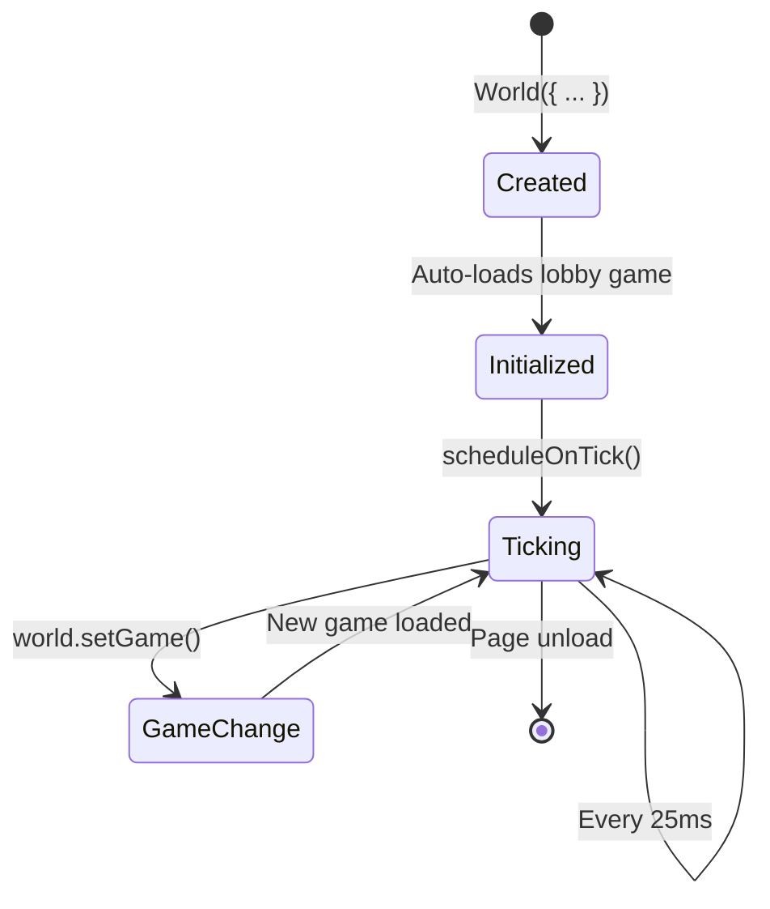

## What is the World?

The **World** is the central runtime that manages:
- **Entities** - All game objects
- **Systems** - Game logic processors  
- **Game state** - Current game, settings, networked data
- **Tick loop** - Fixed timestep simulation
- **Render loop** - Variable framerate rendering

```typescript
// From: core/src/runtime/World.ts:11
export type World = {
  // State
  entities: Record<string, Entity>
  systems: Record<string, System>
  tick: number
  tickrate: number  // ms per tick (default 25)
  time: DOMHighResTimeStamp
  mode: "client" | "server"
  
  // Game
  game: Game & { started: number }
  games: Record<GameTitle, GameBuilder>
  
  // Networking
  client: Client | undefined
  actions: TickBuffer<InvokedAction>
  messages: TickBuffer<string>
  entitiesAtTick: Record<number, Record<string, SerializedEntity>>
  
  // Rendering
  pixi: PixiRenderer | undefined
  three: ThreeRenderer | undefined
  
  // Physics
  physics: RapierWorld | undefined
  blocks: BlockData
  
  // Methods
  addEntity: (entity: Entity) => string | undefined
  removeEntity: (id: string) => void
  addSystems: (systems: System[]) => void
  removeSystem: (id: string) => void
  queryEntities: <T>(query: ValidComponents[], filter?: (e: Entity<T>) => boolean) => Entity<T>[]
  onTick: (params: { isRollback: boolean, force?: boolean }) => void
  onRender: () => void
  setGame: (game: GameTitle) => void
  // ...
}
```

## Creating a World

### Client World

```typescript
import { World, PixiRenderer, ThreeRenderer } from "@piggo-gg/core"

const world = World({
  mode: "client",
  pixi: PixiRenderer(),
  three: ThreeRenderer(),
  systems: [/* optional initial systems */],
  commands: [/* optional commands */]
})
```

### Server World

```typescript
const world = World({
  mode: "server"
  // No renderers needed on server
})
```

<Note>
The world automatically starts ticking after creation and loads the default game (usually "lobby").
</Note>

## The Tick Loop

The tick loop runs at a **fixed 25ms interval** (40 ticks per second):

```typescript
// From: core/src/runtime/World.ts:173
onTick: ({ isRollback, force }) => {
  if (!force && world.flag === "red") return
  
  const now = performance.now()
  
  // Check if it's time for next tick
  if (!isRollback && !force && ((world.lastTick + world.tickrate) > now)) {
    scheduleOnTick()
    return
  }
  
  // Update tick counter
  world.tick += 1
  world.time = now
  
  // Store entity snapshots for rollback
  world.entitiesAtTick[world.tick] = {}
  for (const entityId in world.entities) {
    if (world.entities[entityId].components.networked) {
      world.entitiesAtTick[world.tick][entityId] = world.entities[entityId].serialize()
    }
  }
  
  // Run systems by priority
  values(world.systems)
    .sort((a, b) => a.priority - b.priority)
    .forEach((system) => {
      if (!isRollback || (isRollback && !system.skipOnRollback)) {
        system.onTick?.(filterEntities(system.query, values(world.entities)), isRollback)
      }
    })
  
  // Run system onTickEnd callbacks
  values(world.systems).forEach((system) => {
    if (!isRollback || (isRollback && !system.skipOnRollback)) {
      system.onTickEnd?.()
    }
  })
  
  // Schedule next tick
  if (!isRollback) scheduleOnTick()
}
```

<Steps>
  <Step title="Increment tick counter">
    `world.tick += 1` - Now at tick 1234
  </Step>
  
  <Step title="Snapshot networked entities">
    Store serialized state for rollback netcode
  </Step>
  
  <Step title="Execute systems by priority">
    Input → AI → Physics → etc.
  </Step>
  
  <Step title="Run onTickEnd callbacks">
    Cleanup, post-processing
  </Step>
  
  <Step title="Schedule next tick">
    After 25ms, repeat
  </Step>
</Steps>

### Rollback Support

When using rollback netcode, the world can re-simulate past ticks:

```typescript
// Server says tick 100 state was different
world.tick = 100  // Rewind

// Restore entities to tick 100 state
for (const entityId in serverEntities) {
  world.entities[entityId].deserialize(serverEntities[entityId])
}

// Re-simulate ticks 100-110
for (let i = 0; i < 10; i++) {
  world.onTick({ isRollback: true })  // Systems know it's rollback
}
```

<Warning>
Systems with `skipOnRollback: true` won't run during rollback (e.g., particle systems, sound effects).
</Warning>

## The Render Loop

The render loop runs at **display refresh rate** (60-144 FPS):

```typescript
// From: core/src/runtime/World.ts:240
onRender: () => {
  const now = performance.now()
  const delta = now - world.time        // Time since last tick
  const since = now - lastRender        // Time since last render
  
  if (world.pixi || world.three) {
    values(world.systems).forEach((system) => {
      system.onRender?.(filterEntities(system.query, values(world.entities)), delta, since)
    })
    lastRender = now
    
    // Update FPS counter
    if (world.tick % 40 === 0 && framesThisSecond > 10) {
      world.client!.fps = framesThisSecond
      framesThisSecond = 0
    }
    framesThisSecond += 1
  }
}
```

### Interpolation

Since rendering runs faster than ticking, entities interpolate between tick states:

```typescript
// From: core/src/ecs/components/Position.ts:169
interpolate: (world: World, delta: number) => {
  // delta = 12.5 (halfway between ticks)
  // Interpolate position based on velocity
  const x = position.data.x + position.localVelocity.x * delta / 1000
  const y = position.data.y + position.localVelocity.y * delta / 1000
  const z = position.data.z + position.localVelocity.z * delta / world.tickrate
  
  return { x, y, z }  // Smooth position between ticks
}
```

This creates smooth 60 FPS motion even though game logic only updates 40 times per second.

## Managing Entities

### Adding Entities

```typescript
// From: core/src/runtime/World.ts:109
world.addEntity(player)
// Entity is now in world.entities[player.id]

// Batch add
world.addEntities([player, enemy, bullet])
```

### Removing Entities

```typescript
// From: core/src/runtime/World.ts:127
world.removeEntity("player-123")
// Calls cleanup on renderable, three, html, inventory components
// Sets entity.removed = true
```

<Tip>
Removed entities are cleaned up automatically. Components with `cleanup()` methods release resources (remove DOM nodes, dispose geometries, etc.).
</Tip>

### Querying Entities

```typescript
// From: core/src/runtime/World.ts:269
const players = world.queryEntities<PC>(["pc"])

const team1Players = world.queryEntities<PC | Team>(["pc", "team"], (entity) => {
  return entity.components.team.data.team === 1
})

// Direct access
const player = world.entity<Position>("player-123")
if (player) {
  console.log(player.components.position.data.x)
}
```

### Helper Methods

```typescript
// All players
const players = world.players()  // queryEntities(["pc"])

// All controlled characters
const characters = world.characters()

// Is this client/server authoritative?
const auth = world.authoritative()  // true on server or solo client
```

## Managing Systems

### Adding Systems

```typescript
// From: core/src/runtime/World.ts:144
world.addSystems([
  PhysicsSystem("global"),
  PixiRenderSystem
])

// Add via SystemBuilder
world.addSystemBuilders([
  MyCustomSystem,
  AnotherSystem
])
```

### Removing Systems

```typescript
// From: core/src/runtime/World.ts:139
world.removeSystem("PhysicsSystem")
// If system had data, also removes SystemEntity-PhysicsSystem
```

## Game Management

### Setting the Active Game

```typescript
// From: core/src/runtime/World.ts:273
world.setGame("volley")
```

This triggers a complete game transition:

<Steps>
  <Step title="Remove old entities">
    All non-persistent entities are removed
    ```typescript
    for (const entity of values(world.entities)) {
      if (!entity.persists) world.removeEntity(entity.id)
    }
    ```
  </Step>
  
  <Step title="Clear game state">
    Blocks, trees, DOM elements, music
  </Step>
  
  <Step title="Remove old systems">
    Previous game's systems are unregistered
  </Step>
  
  <Step title="Initialize new game">
    ```typescript
    world.game = { ...game.init(world), started: world.tick + 2 }
    ```
  </Step>
  
  <Step title="Add new entities and systems">
    New game's entities and systems are registered
  </Step>
  
  <Step title="Activate renderer">
    Switch between Pixi (2D) and Three.js (3D) if needed
  </Step>
</Steps>

### Game State and Settings

```typescript
// Type-safe access to game state
const state = world.state<VolleyState>()
state.scoreLeft += 1

// Type-safe access to settings
const settings = world.settings<VolleySettings>()
if (settings.showControls) {
  // ...
}
```

<Note>
Game state is automatically networked via the `gameState` entity created during `setGame`.
</Note>

## Tick Buffers

The world maintains buffers for actions and messages keyed by tick:

```typescript
// Store action at tick 100
world.actions.set(100, "player-123", [{ actionId: "jump", /* ... */ }])

// Get all actions at tick 100
const tick100Actions = world.actions.atTick(100)

// Get all actions from tick 100 onward
const recentActions = world.actions.fromTick(100)

// Clear old data
world.actions.clearBeforeTick(world.tick - 20)
```

This enables:
- **Rollback netcode** - Re-apply actions from past ticks
- **Network reconciliation** - Compare local vs. server actions
- **Replay** - Store and replay game sessions

## World Lifecycle



## Best Practices

<AccordionGroup>
  <Accordion title="Don't mutate world.tick">
    ❌ `world.tick = 100` (except during rollback)
    
    ✅ Let the tick loop manage it
  </Accordion>
  
  <Accordion title="Clean up resources">
    Always implement `cleanup()` on components that create resources:
    ```typescript
    renderable.cleanup = () => {
      pixi.stage.removeChild(renderable.c)
    }
    ```
  </Accordion>
  
  <Accordion title="Use world.authoritative()">
    Check before applying game-changing logic:
    ```typescript
    if (world.authoritative()) {
      // Spawn enemies, apply damage, etc.
    }
    ```
  </Accordion>
  
  <Accordion title="Persist player data">
    Mark player entities with `persists: true` so they survive game changes:
    ```typescript
    const player = Entity({
      id: "player-123",
      persists: true,  // Survives setGame()
      components: { /* ... */ }
    })
    ```
  </Accordion>
</AccordionGroup>

## Next Steps

<CardGroup cols={3}>
  <Card title="Games" icon="gamepad" href="/concepts/games">
    Create a GameBuilder
  </Card>
  <Card title="Netcode" icon="network-wired" href="/concepts/netcode">
    Sync worlds over network
  </Card>
  <Card title="Physics" icon="atom" href="/concepts/physics">
    Add world.physics
  </Card>
</CardGroup>
