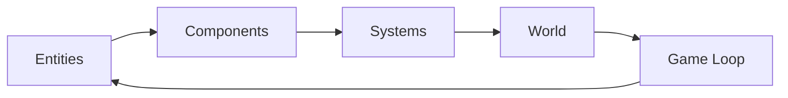

## Welcome to Piggo Games

Piggo is a multiplayer browser game framework built for gaming with friends. It combines a powerful ECS (Entity Component System) architecture with server-authoritative netcode to deliver smooth, performant multiplayer experiences.

<CardGroup cols={2}>
  <Card
    title="Quickstart"
    icon="bolt"
    href="/quickstart"
  >
    Get your first game running in minutes
  </Card>
  <Card
    title="Installation"
    icon="download"
    href="/installation"
  >
    Set up the development environment
  </Card>
  <Card
    title="Core Concepts"
    icon="lightbulb"
    href="/concepts/ecs"
  >
    Learn about the ECS architecture
  </Card>
  <Card
    title="API Reference"
    icon="code"
    href="/api/world"
  >
    Explore the complete API
  </Card>
</CardGroup>

## Key Features

<AccordionGroup>
  <Accordion title="ECS Architecture" icon="cubes">
    Built on a clean Entity Component System pattern that separates data (components) from behavior (systems), making games easy to extend and maintain.
  </Accordion>

  <Accordion title="Server-Authoritative Multiplayer" icon="server">
    Supports both delay-based and rollback netcode for smooth, cheat-resistant multiplayer gameplay with msgpack serialization over WebSockets.
  </Accordion>

  <Accordion title="Dual Rendering" icon="paintbrush">
    Choose between **PixiJS** for 2D games or **ThreeJS** for 3D games, with seamless integration into the ECS workflow.
  </Accordion>

  <Accordion title="Physics Engine" icon="atom">
    Integrated **RapierJS** physics engine for realistic 2D and 3D physics simulation.
  </Accordion>

  <Accordion title="Audio System" icon="volume">
    Built-in **ToneJS** integration for dynamic sound effects and music.
  </Accordion>

  <Accordion title="Monorepo Structure" icon="folder-tree">
    Organized as a Bun workspace with separate packages for core engine, web client, game server, and Electron desktop wrapper.
  </Accordion>
</AccordionGroup>

## Architecture Overview

### Monorepo Structure

Piggo is organized as a monorepo with the following packages:

| Package | Description |
|---------|-------------|
| `core` | ECS engine and game logic |
| `web` | Browser-based client application |
| `server` | Game server with API and matchmaking |
| `docs` | Static bundle served via GitHub Pages |
| `electron` | Desktop application wrapper |

### Core Technologies

Piggo leverages industry-leading libraries:

| Dependency | Purpose |
|------------|----------|
| [ThreeJS](https://github.com/mrdoob/three.js) | 3D graphics rendering |
| [PixiJS](https://github.com/pixijs/pixijs) | 2D graphics rendering |
| [RapierJS](https://github.com/dimforge/rapier.js/) | Physics simulation |
| [ToneJS](https://github.com/tonejs/tone.js/) | Audio and sound |
| [msgpack](https://github.com/msgpack/msgpack-javascript) | Binary serialization |
| [Prisma](https://www.prisma.io/) | Database ORM (server) |

### ECS Workflow

1. **Entities** are plain objects with unique IDs
2. **Components** hold data (position, velocity, health, etc.)
3. **Systems** contain logic that operates on entities with specific components
4. **World** manages the game loop, tick rate, and entity lifecycle
5. **Game Loop** runs systems every tick and renders frames

<Note>
  Piggo uses a strict "no class" coding style - all entities and systems are created via factory functions that return plain objects.
</Note>

## Product Objectives

🐷 **Build great games** - Focus on gameplay and player experience

🕹️ **Clean UI/UX** - Intuitive interfaces that get out of the way

🥳 **Easy to play with friends** - Seamless multiplayer matchmaking

## Technical Objectives

👨🏻‍💻 **Readable code** - Clear, maintainable TypeScript with strict null checks

🎮 **Simple game creation** - Adding new games should be straightforward

👾 **Smooth & performant** - 60 FPS rendering with optimized netcode

## Next Steps

<CardGroup cols={2}>
  <Card
    title="Get Started"
    icon="play"
    href="/quickstart"
  >
    Build your first game in under 5 minutes
  </Card>
  <Card
    title="Learn ECS"
    icon="graduation-cap"
    href="/concepts/ecs"
  >
    Understand the Entity Component System
  </Card>
</CardGroup>
